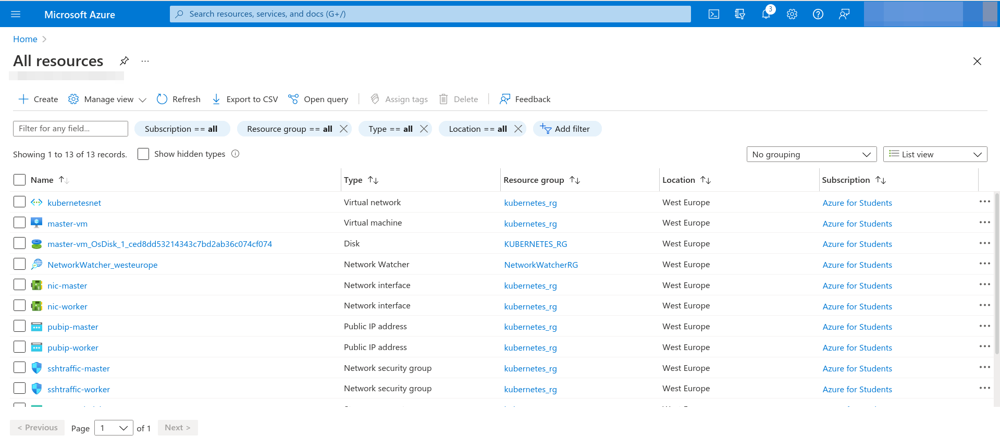
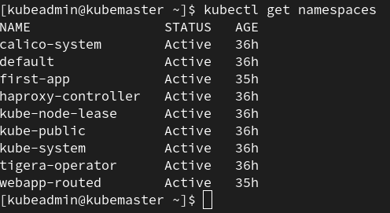

# Informe

Se debe entregar **ÚNICAMENTE** un informe en PDF que contenga la siguiente información:

* El informe se debe plantear como si fuera un informe que se entrega a un cliente.
* URL del repositorio Git donde se encuentra el código de la práctica.
* El repositorio debe tener la estructura indicada en el [repositorio](https://github.com/jadebustos/devopslabs/tree/master/estructura-practica).
* El repositorio deberá permanecer privado y se deberá hacer público una vez finalizado el plazo de entrega de la práctica.
* Debe ser accesible publicamente.
* El informe debe incluir diagramas explicativos de la infraestructura que se ha desplegado en el proveedor Cloud.
* El informe deberá incluir información sobre el sizing de las VMs, flujos de comunicaciones abiertos hacía el exterior, ...
* Se deben detallar los problemas que se han encontrado, como se han solucionado y referencias que se han consultado.
* Si no se ha podido solucionar algún problema, se debe analizar y describir el proceso de troubleshooting que se ha realizado. Indicar conclusiones y posibles soluciones.
* En el informe **NO** se debe incluir información técnica sobre el código entregado.
* El objetivo del informe es que **un cliente** a partir del repositorio de código y con el informe sea capaz de realizar el despliegue de kubernetes en el cloud provider, junto con la aplicación a desplegar y acceder a ella.
* Se deberá crear un Anexo incluyendo las siguientes captura de pantallas (las capturas que se incluyen son ejemplos orientativos, la información no tiene por que corresponder con el despliegue que haga cada alumno):

  * Captura de la sección de **Recursos** creados Azure mostrando **TODOS** los recursos creados. Si es necesario incluir varias caputas.

  

  

  * Captura del portal de Azure mostrando el direccionamiento público asinado a cada servidor:

  **INCLUIR IMAGEN**

  * Captura de la salida del comando:

  ```console
  $ kubectl get nodes -o wide
  ```
  

  * Captura de la salida del comando:

  ```console
  $ kubectl get pods -A -o wide
  ```
  

  * Captura de la salida del comando:

  ```console
  $ kubectl get namespaces
  ```
  

  * Captura de la salida del comando:

  ```console
  $ kubectl get svc -A -o wide
  ```
  

  * Captura de la salida del comando:

  ```console
  $ kubectl get ingress -A
  ```
  **INCLUIR IMAGEN**

  * Captura de la salida del comando:

  ```console
  $ kubectl get pv -A
  ```
  **INCLUIR IMAGEN**

  * Captura de la salida del comando:

  ```console
  $ kubectl get pvc -A
  ```
  **INCLUIR IMAGEN**